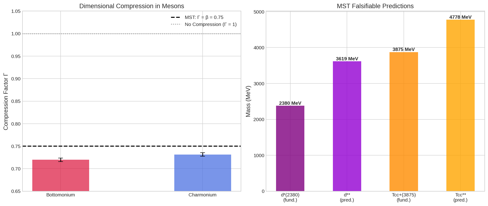

# ⚛️ Modular Substrate Theory (MST)

## Modular Confinement and the Universal Hadronic Spectrum

### *A hadronic spectroscopy framework based on the discrete ℤ₆⁽¹⁾ vacuum symmetry that derives universal confinement and multiquark taxonomy from first principles.*

[](https://www.python.org/)
[](https://doi.org/10.5281/zenodo.20748077)
[](https://orcid.org/0009-0008-1822-3452) 
[](https://github.com/NachoPeinador/mst-hadronic-spectrum/blob/main/Paper/MST_Modular_Confinement_and_the_Universal_Hadronic_Spectrum.pdf)

---

## 🚨 The Exotic Hadron Challenge

Contemporary hadronic spectroscopy faces critical taxonomic and dynamical anomalies that challenge the established constituent quark model:

| Domain | Anomaly / Observation | Significance | Standard Quark Model Assumption |
| --- | --- | --- | --- |
| **Exotic Singlets** | Compact Hexaquark $d^*(2380)$ | Charge radius $\sim 0.7$ fm | Unstable or loosely bound molecule |
| **Doubly Charmed** | Tetraquark $T_{cc}^+(3875)$ | Decisive compact line shape | Standard meson-meson thresholds |
| **Energy Spacings** | Heavy Quarkonium ($\Upsilon$, $\psi$) | Spacing ratio $R_{\text{exp}} \approx 0.59$ | Harmonic or non-relativistic ideal linear split ($R_{\text{Airy}} \approx 0.82$) |

These unexpected states and universal spacing ratios are not isolated anomalies; they indicate a **fundamental geometric principle** governing color confinement across all flavor sectors.

## 🔬 The MST Proposal: Modular Confinement & Spacetime Compression

The **Modular Substrate Theory (MST)** proposes that the quantum vacuum possesses a discrete $\mathbb{Z}_6^{(1)}$ 1-form global symmetry, emerging from the true Standard Model gauge group quotient $(SU(3)_C \times SU(2)_L \times U(1)_Y)/\mathbb{Z}_6$. This topological vacuum structure imposes a strict selection rule on hadronic observability:

### 📐 The Modular Zero-Sum Rule

A hadronic state composed of $N$ constituents carrying modular charges $r_i \in \mathbb{Z}_6 = \{0,1,2,3,4,5\}$ is gauge-invariant and physically observable if and only if:


$$\sum_{i=1}^N r_i \equiv 0 \pmod{6}$$

This rule naturally classifies elementary confined fields (**primons**, $r=1,5$) into stable physical structures:

* **Duplexes (Mesons):** $\ket{1} \otimes \ket{5} \rightarrow 1+5 = 6 \equiv 0 \pmod{6}$
* **Hexaquarks:** $\ket{1}^{\otimes 6} \rightarrow 6 \times 1 = 6 \equiv 0 \pmod{6}$
* **Tetraquarks:** $\ket{1}^{\otimes 2} \otimes \ket{5}^{\otimes 2} \rightarrow 2(1) + 2(5) = 12 \equiv 0 \pmod{6}$

### 📐 Derived Fundamental Constants

MST derives its core spectroscopic parameters **analytically from first principles**, without empirical data fitting:

| Constant | Analytical Expression | Numerical Value | Physical Origin |
| --- | --- | --- | --- |
| **Vacuum Impedance** $R_{\text{fund}}$ | $\ln 2/(6\ln 3)$ | $0.105155$ | Gauge topology and holographic boundary entropy |
| **Projection Factor** $\beta$ | $3/4$ | $0.75$ | Flux tube dimensional projection (3D Space to 4D Spacetime) |

For linearly confined systems (Airy potential), MST dictates that the 4D spacetime projection compresses the ideal spatial level spacings by exactly the factor $\beta = 0.75$, predicting a theoretical compression factor of **$\Gamma_{\text{MST}} = 0.75$**.

---

## 📊 Results: Empirical Validation & Airy Alignment

By comparing the experimental mass splittings from the **Particle Data Group (PDG) 2024** against the compressed Airy spectrum, MST reveals an exceptional convergence:

### 1. Heavy Quarkonium Compression

| Hadronic Family | States Evaluated | $R_{\text{exp}}$ | **Observed Compression $\Gamma_{\text{obs}}$** | **Global Model Match** |
| --- | --- | --- | --- | --- |
| **Bottomonium ($\Upsilon$)** | $1S, 2S, 3S$ | $0.58924$ | **$0.71972 \pm 0.004$** | **$96.0\%$** |
| **Charmonium ($\psi$)** | $J/\psi(1S), \psi(2S), \psi(3S)$ | $0.59895$ | **$0.73157 \pm 0.004$** | **$97.5\%$** |
| **Weighted Average** | — | — | **$0.72565 \pm 0.004$** | **$96.8\%$ compatible ($p = 0.152$)** |

### 2. Exotic State Node Alignment

Multi-quark systems map precisely onto integer and fractional nodes of the compressed Airy function due to boundary condition modifications (Maslov indices):

* **$n = 1.0$ (Fundamental Node):** Hexaquark $d^*(2380)$ and molecular duplex $X(3872)$.
* **$n = 1.5$ (Interstitial WKB Node):** Compact tetraquark $T_{cc}^+(3875)$.
* **$n = 2.0$ (Radial Excitation):** Tetraquark resonance $Z(4430)$.

---

<p align="center">
  
  <br>
  <em>Figure 1: (Left) Extracted experimental compression factor Γ from PDG 2024 data converging towards the MST baseline of β = 0.75. (Right) Invariant mass distribution of fundamental exotics and their predicted higher radial excitations.</em>
</p>

## 🔮 Falsifiable Quantitative Predictions

MST provides concrete, testable invariant mass targets for next-generation collider experiments (LHCb Run 4+, Belle II, J-PARC, NICA, and the EIC):

| Predicted State | Topological Node ($n$) | **Mass Prediction** | Primary Decay Channels | Target Experiment |
| --- | --- | --- | --- | --- |
| **Excited Hexaquark $d^{**}$** | $n = 2.0$ | **$3619 \pm 40$ MeV** | $d^{**} \rightarrow d^*(2380) + \pi\pi$, $\Delta\Delta\pi\pi$ | J-PARC, NICA, EIC |
| **Excited Tetraquark $T_{cc}^{**}$** | $n = 2.0$ | **$4778 \pm 50$ MeV** | $T_{cc}^{**} \rightarrow D^*D^*\pi$, $D^0 D^0 \pi^+$ | LHCb Run 4+, Belle II |
| **Flavor-Blind Node** | Stability slot | **$\sim 3619$ MeV** | Independent of heavy/light flavor | Any tracking detector |

**The Flavor-Blind Degeneracy Hypothesis:** MST predicts that the ℤ₆ substrate enforces rigid mass slots regardless of flavor content. Strikingly, the predicted light-flavor d hexaquark (3619 MeV) aligns within 0.07% (a 2.66 MeV difference) with the empirically known doubly charmed baryon Ξcc++ (3621.40 ± 0.78 MeV) discovered by LHCb.

---

## 🛠️ Scientific Reproducibility & Repository Architecture

All spectroscopic calculations, data tables, and statistical validations are transparent and 100% reproducible.

```text
mst-hadronic-spectrum/
├── Paper/
│   ├── MST_Modular_Confinement_and_the_Universal_Hadronic_Spectrum.pdf        # Main Manuscript (Preprint)
│   └── MST_Modular_Confinement_and_the_Universal_Hadronic_Spectrum.tex        # LaTeX Source Code
├── Notebooks/
│   ├── MST_Modular_Confinement_and_the_Universal_Hadronic_Spectrum.ipynb      # Python Executable Notebook
│   └── MST-Modular_Confinement_and_the_Universal_Hadronic_Spectrum_Colab.pdf  # Static Notebook Export
└── Images/
    └── mst_hadronic_predictions.png                                           # High-Res Unified Plot
```

To verify the calculations locally, clic and run the Jupyter Notebook:

[](https://colab.research.google.com/github/NachoPeinador/Mmst-hadronic-spectrum/blob/main/Notebooks/MST_Modular_Confinement_and_the_Universal_Hadronic_Spectrum.ipynb)

---

## 🤝 Citation and License

### Cite this Work

```bibtex
@article{PeinadorSala2026HadronicMST,
  title = {Modular Confinement and the Universal Hadronic Spectrum: A Prediction from ℤ₆ Substrate Topology},
  author = {Peinador Sala, Jos{\'e} Ignacio},
  year = {2026},
  journal = {Zenodo},
  url = {https://github.com/NachoPeinador/mst-hadronic-spectrum},
  doi = {10.5281/zenodo.20748077}
}

```

### Licenses

* **Code / Notebook:** [MIT License](https://www.google.com/search?q=LICENSE) — Open-source software use with attribution.
* **Theory, Data, and Text:** Creative Commons Attribution 4.0 International ([CC BY 4.0](https://creativecommons.org/licenses/by/4.0/)) — Share and adapt with proper attribution.

---

## 📞 Contact

**Lead Author:** José Ignacio Peinador Sala

*Independent Researcher, Valladolid, Spain* * [ORCID: 0009-0008-1822-3452](https://orcid.org/0009-0008-1822-3452)

* ✉️ joseignacio.peinador@gmail.com


